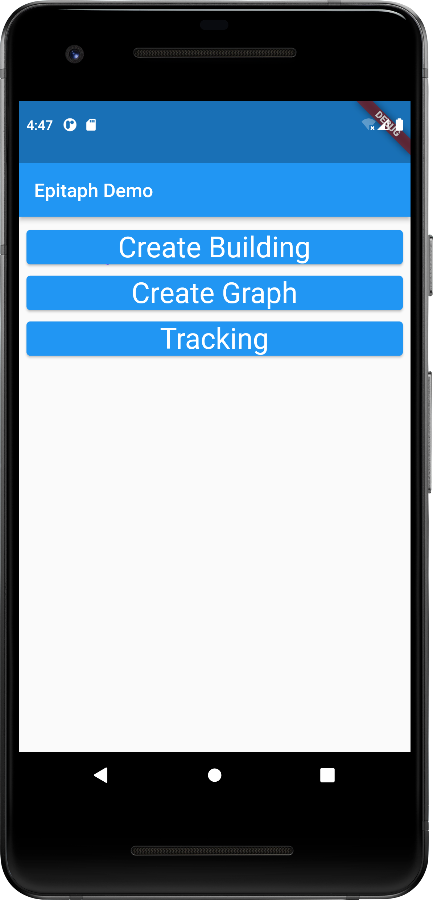
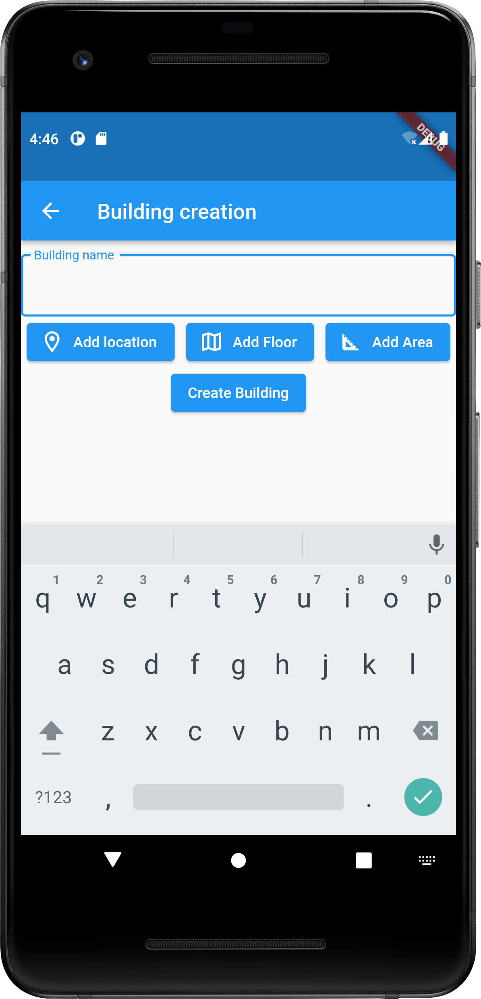
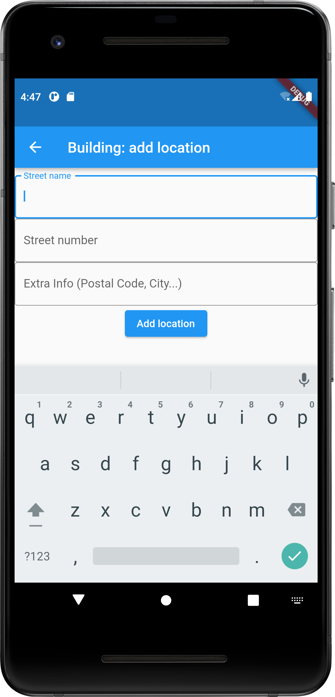
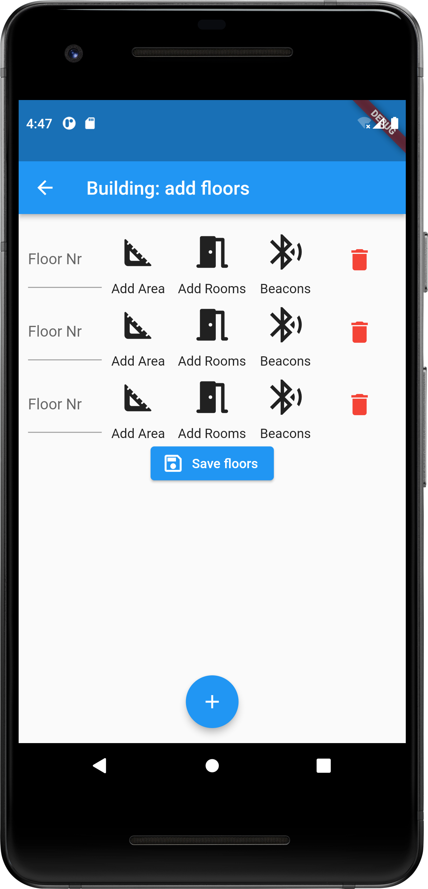
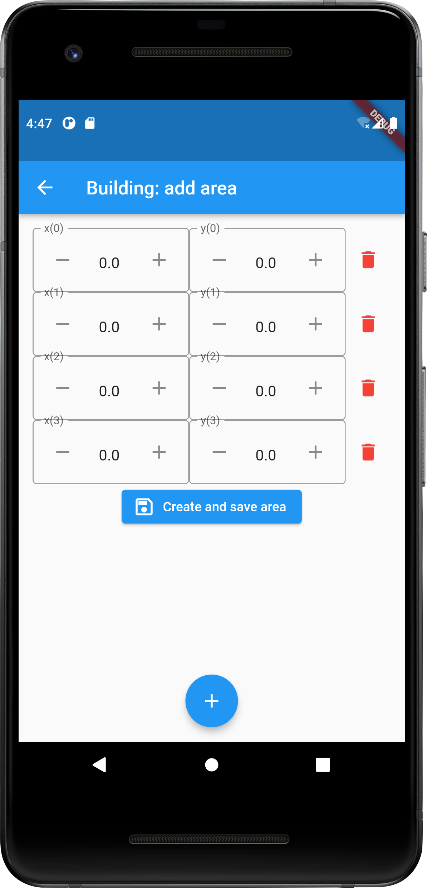

# Example App

This App shows some components of Epitaph IPS Library

## Building creation

For more information see [Building class](https://pub.dev/documentation/epitaph_ips/latest/epitaph_ips_buildings_building/Building-class.html)

Homescreen | Building Form | Location Form
 :-:|:-:|:-:|
  |   |  

Add Floors Form | Add Polygonal Area Form
:-:|:-:
 | 

Build with Flutter.